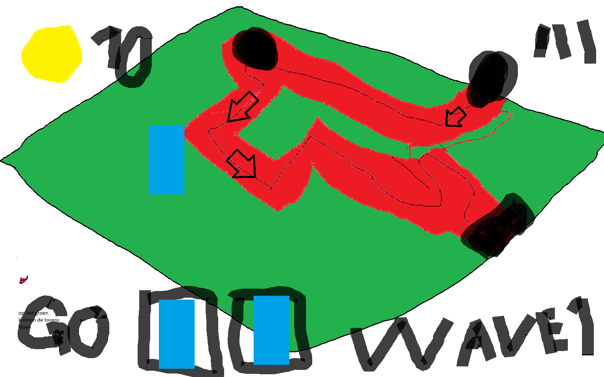

# BO-TD-M5

# Game Design Document: Tower Defense
## Naam: Pascal
## Klas: SD2A
## Datum: 23/09/2026

## 1. Titel en elevator pitch
### Titel: tower shoot

### Mijn spel is tower shoot wat het leuk maakt om te spelen is dat het simpel is om te begrijpen
## 2. Wat maakt jouw tower defense uniek
### Wat mijn spel anders maakt als andere Tower Defense spelen is dat het erg simpel is

## 3. Schets van je level en UI
 
### Blauw: torens
### Zwart: Enemies
### De drie streepjes is het pauze menu
### De pijlen zijn de richting die de enemies volgen
## 4. Torens

### 1.	Archer, medium bereik, 5 schade
### 2.	Wizard, lang bereik, 3 schade

## 5. Vijanden
### 1.	Vijand 1 Jeff, normale snelheid, 5 levens, niets speciaals
### 2.	Vijand 2 Bob, langzamer dan Jeff, 7 levens, 
#### Eventuele extra vijanden:
#### Big jos is een boss fight en heeft een paar jeff’s bij zich

## 6. Gameplay loop
### 1.	Speler plaatst toren 
### 2.	Speler start wave
### 3.	Speler verzamelt coins
### 4.	Speler upgrade toren

## 7. Progressie
### Er kommen steeds meer enemies en sneller achter elkaar per wave die voorbij is gegaan

## 8. Risico’s en oplossingen volgens PIO
### •	Probleem 1: speler kan geen toren plaatsen
### •	Impact: je kunt niet verdedigen
### •	Oplossing: de koop knoop fixen
### •	Probleem 2: speler kan geen in-game geld krijgen
### •	Impact: kan geen torens kopen
### •	Oplossing: start geld geven en de enemies geld waard maken
### •	Probleem 3: de startwaveknop werkt niet 
### •	Impact: de speler kan maar 1 wave spelen
### •	Oplossing: andere waves aanmaken
## 9. Planning per sprint en mechanics
### Sprint 1 mechanics: enemies die waypoints volgen
### Sprint 2 mechanics: torens die schieten en upgradebaar zijn
### Sprint 3 mechanics: een start Wave knop en andere UI
### Sprint 4 mechanics:
### Sprint 5 mechanics:

## 10. Inspiratie
### Mijn inspiratie is van de tutorial video

## 11. Technisch ontwerp mini
## 11.1 Vijandbeweging over het pad
### •	Keuze: vijanden volgen waypoints naar het doel
### •	Risico: de enemies kunnen verkeerd lopen
### •	Oplossing: elke keer als ze een waypoint voorbij zijn zoeken ze naar de volgende die een nummer hoger is
### •	Acceptatie: de enenmies lopen van punt naar punt
## 11.2 Doel kiezen en schieten
### •	Keuze: het doel is om om de enemy te schieten die de meeste progressie heeft gemaakt
### •	Risico: het kan lastigere enemies overslaan 
### •	Oplossing: de lastigere enemies lopen langzamer
### •	Acceptatie: de sterkere enemies lopen langzamer dus ze zijn makelijker te raken
## 11.3 Waves en spawnen
### •	Keuze: naar mate de het spel vordert komen er meer enemies per wave
### •	Risico: je kunt slechter verdedigen tegen de enemies
### •	Oplossing: de lastigere enemies zijn langzamer 
### •	Acceptatie: de enemies die minder leven hebbn schiet je eerder dood
## 11.4 Economie en levens
### •	Keuze: je hebt 100 levens dus je kun 100 keert geraakt worden door jeff’s
### •	Risico: je kunt makkelijk verdedigen
### •	Oplossing: de bob's hebben meer leven
### •	Acceptatie: er zijn lastigere enemies waar door het lastiger word
## 11.5 UI basis
### •	Keuze: je hebt een go-button om het level te starten
### •	Risico: je kunt heel snel achter elkaar waves laten komen
### •	Oplossing: een cooldown button
### •	Acceptatie: je moet eerst wachten tot elke enemy van een wave dood is om een andere wave te starten
